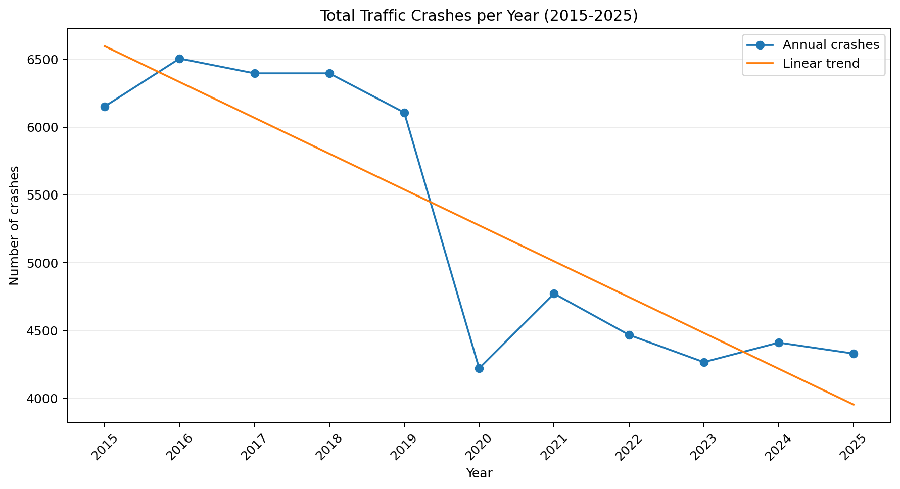
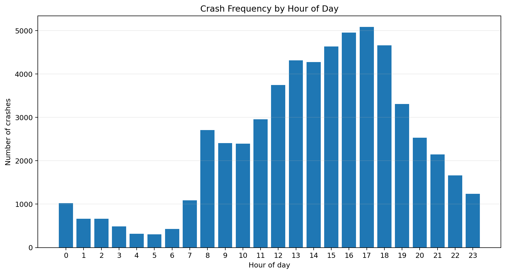
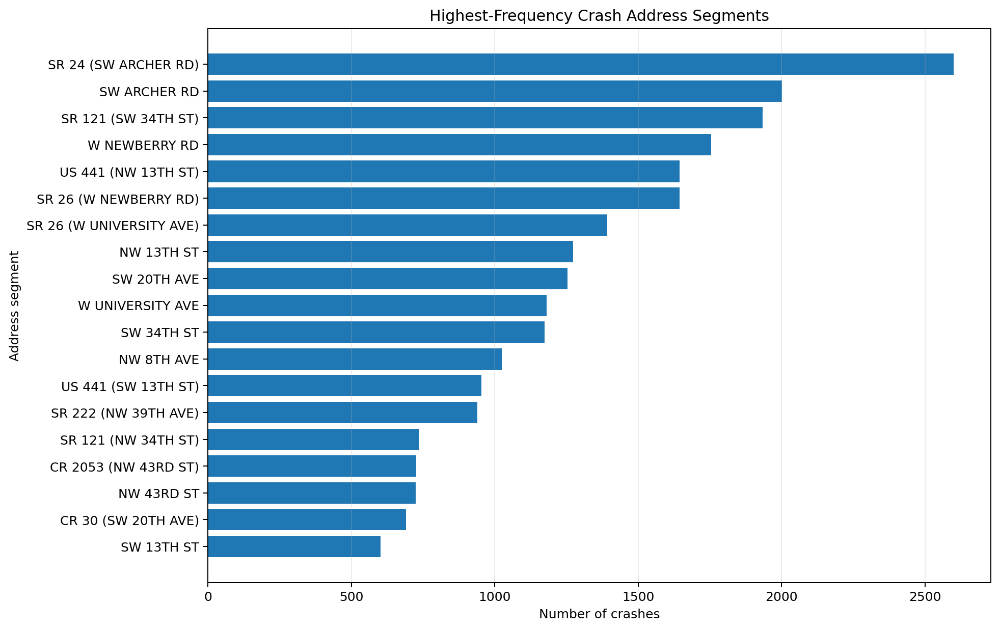

# Gainesville Traffic Crash Analysis (2015-2025)
[`reports/Crash_Busters_Final_Report.pdf`](reports/Crash_Busters_Final_Report.pdf)


## Project Overview

Gainesville's transportation environment includes motorists, pedestrians, cyclists, buses, mopeds, motorcycles, and a growing micromobility network. This project uses public crash records to identify where and when crashes occur, determine whether outcomes differ by road-user type, and translate analytical findings into practical traffic-safety priorities.

This was completed as a team project for **ISM 6423: Data Analysis for Decision Support** at the University of Florida.

A data analytics and statistical modeling project examining **58,032 traffic crashes** recorded in Gainesville, Florida, from 2015 through 2025. The analysis focuses on long-term crash trends, vulnerable road users, fatality risk, high-risk time windows, and recurring crash corridors.



## Questions Addressed

1. How have total and fatal crashes changed from 2015 to 2025?
2. Are crashes involving pedestrians or cyclists associated with a greater likelihood of fatal outcomes?
3. Which hours and road segments show the highest crash concentration?
4. Does intersection status meaningfully predict fatality after controlling for crash type?
5. Did the relative fatality risk for vulnerable-road-user crashes change after 2020?

## Dataset

- **Source:** City of Gainesville Open Data Portal - Traffic Crashes
- **Maintainer:** Gainesville Police Department
- **Raw snapshot:** 78,921 rows and 27 columns
- **Primary study period:** 2015-2025
- **Study sample:** 58,032 crashes
- **Partial 2026 records identified:** 390, excluded from the main trend analysis

Key fields include crash date and hour, address, intersection type, road-user counts, vehicle counts, fatalities, and geographic coordinates. Data-download instructions are available in [`data/README.md`](data/README.md).

## Analytical Workflow

```text
Public crash data
      |
      v
Data audit and cleaning
      |
      v
Date, time, crash-type, severity-proxy, and period features
      |
      v
EDA: annual, hourly, location, intersection, and road-user trends
      |
      v
Chi-square association test
      |
      v
Logistic regression and pre/post-COVID comparison
      |
      v
Policy-oriented findings and recommendations
```

### Feature Engineering

- Parsed crash dates and created year, month, quarter, week, and year-month fields.
- Classified crashes as `Motor Vehicle Only`, `Involving Cyclist`, `Involving Pedestrian`, or `Multi-Vulnerable`.
- Created morning, afternoon, evening, and night time bands.
- Created a binary `IsFatal` outcome from the official `Total Fatalities` field.
- Created pre-COVID (2015-2019) and post-COVID (2020-2025) periods for normalized comparison.
- Created intersection indicators for regression analysis.

## Key Findings

### 1. Total crashes declined, but fatal crashes were comparatively stable

Annual crashes decreased from **6,152 in 2015 to 4,331 in 2025**, a reduction of approximately **29.6%**. The sharpest disruption occurred in 2020, while annual fatal-crash counts showed a much weaker downward pattern.

### 2. Most crashes involved motor vehicles only

| Crash type | Count | Share |
|---|---:|---:|
| Motor Vehicle Only | 55,562 | 95.75% |
| Involving Pedestrian | 1,297 | 2.24% |
| Involving Cyclist | 1,171 | 2.02% |
| Multi-Vulnerable | 2 | <0.01% |

Although pedestrian and cyclist crashes were much less frequent, they represented a disproportionately important safety concern because fatality risk was not uniform across crash types.

### 3. Crash type and fatality were strongly associated

The chi-square test produced **chi-square = 609.41** with **p = 9.211e-132**, providing strong evidence of an association between crash type and fatality outcome.

In the combined logistic regression model:

- Pedestrian involvement had a positive and statistically significant coefficient (**+1.4072, p < 0.001**).
- Motor-vehicle-only crashes had a negative and statistically significant coefficient (**-1.6958, p < 0.001**) relative to the cyclist baseline.
- The general `AtIntersection` indicator was not statistically significant (**p = 0.331**).

### 4. Crash frequency concentrated around commuting hours

Crash counts peaked around **8-9 AM** and **3-6 PM**, while the proportion of fatal crashes was higher during the late-night and early-morning period, particularly **1-5 AM**.



### 5. Recurring high-crash corridors were identifiable

Frequently appearing address segments included **SR 24 / SW Archer Road**, **SW Archer Road**, and **SR 121 / SW 34th Street**. These corridors are candidates for more detailed engineering, exposure, and enforcement analysis.



### 6. The post-2020 period did not significantly change relative vulnerable-user fatality risk

The Difference-in-Differences logistic model found a non-significant interaction term (**coefficient = -0.3819, p = 0.2596**). Vulnerable-road-user crashes remained substantially higher-risk overall, but the analysis did not find evidence that their *relative* fatality likelihood changed significantly after 2020 compared with motor-vehicle-only crashes.

## Business and Policy Interpretation

The results support a targeted rather than uniform traffic-safety strategy:

- Prioritize pedestrian, cyclist, and micromobility safety in corridors with both high frequency and high severity.
- Align enforcement, visibility, and engineering responses with peak crash periods and late-night fatality risk.
- Standardize road and address identifiers before conducting corridor-level performance measurement.
- Evaluate transportation investments using vulnerable-user outcomes, not only total crash counts.

## Tools and Techniques

| Area | Tools / Methods |
|---|---|
| Data preparation | Python, Pandas, NumPy |
| Visualization | Plotly, Matplotlib, Seaborn |
| Statistical testing | SciPy chi-square test |
| Statistical modeling | Statsmodels logistic regression |
| Geographic analysis | Folium, ArcGIS |
| Reproducibility | Jupyter Notebook, requirements file, documented data source |

## Repository Structure

```text
gainesville-traffic-crash-analysis/
├── assets/
│   ├── annual_crash_trend.png
│   ├── crashes_by_hour.png
│   └── top_crash_locations.png
├── data/
│   └── README.md
├── notebooks/
│   └── gainesville_traffic_crash_analysis.ipynb
├── reports/
│   └── Crash_Busters_Final_Report.pdf
├── .gitignore
├── README.md
└── requirements.txt
```

## Run the Analysis

### 1. Clone the repository

```bash
git clone https://github.com/YOUR-USERNAME/gainesville-traffic-crash-analysis.git
cd gainesville-traffic-crash-analysis
```

### 2. Create a virtual environment

```bash
python -m venv .venv
```

Activate it:

```bash
# Windows PowerShell
.venv\Scripts\Activate.ps1

# macOS / Linux
source .venv/bin/activate
```

### 3. Install dependencies

```bash
pip install -r requirements.txt
```

### 4. Add the data

Follow [`data/README.md`](data/README.md), download the CSV, and save it as:

```text
data/Traffic_Crashes_20260412.csv
```

### 5. Launch Jupyter

```bash
jupyter notebook notebooks/gainesville_traffic_crash_analysis.ipynb
```

The notebook also supports the original Google Colab path as a fallback.

## Methodology and Data Limitations

- The Gainesville Police Department dataset does not include crashes under University of Florida Police Department jurisdiction on UF's main campus.
- Inconsistent road naming, such as `SR 24 (SW ARCHER RD)` versus `SW ARCHER RD`, can split a single corridor across categories.
- Some unidentified locations use a default coordinate near **29.65198, -82.32272**; these records should be removed before hotspot mapping.
- Fatal crashes are rare (**150 cases**), creating substantial class imbalance.
- The dataset does not include several potentially important explanatory variables, such as age, detailed injury classification, traffic exposure, speed, weather, lighting, or prior driving history.
- The `Probable Injury` / nonfatal severity category in the notebook is a **project-defined proxy based on people involved**, not an official injury-status measure. Conclusions about injury severity should therefore be treated cautiously.
- The DiD analysis is observational and should not be interpreted as establishing a causal effect of COVID-19.

## Report

The complete written analysis is available in [`reports/Crash_Busters_Final_Report.pdf`](reports/Crash_Busters_Final_Report.pdf).

## Contributors

- Sherrine Fils-Aime
- Sarah Morais
- Yemima Dort
- Shoan Andrew Alex Lnu
- **Mihir Bagadia**
- Trent Burger
- Ian Cueli

Course: **ISM 6423 - Data Analysis for Decision Support**  
Instructor: **Professor Liangfei Qiu**  
University of Florida, 2026

## Portfolio Note

My Individual Contribution
- Engineered analytical features such as crash type, severity, fatality status, crash hour, time-of-day category, and intersection status.
- Conducted a Chi-square test to examine the relationship between crash type and fatality outcomes.
- Developed and interpreted logistic regression models to assess the effects of crash type and intersection characteristics on fatality risk.
- Created Python visualizations for annual trends, hourly patterns, crash severity, crash categories, and high-crash locations.
- Translated statistical results and visual findings into traffic-safety insights for vulnerable road users and high-risk corridors.
